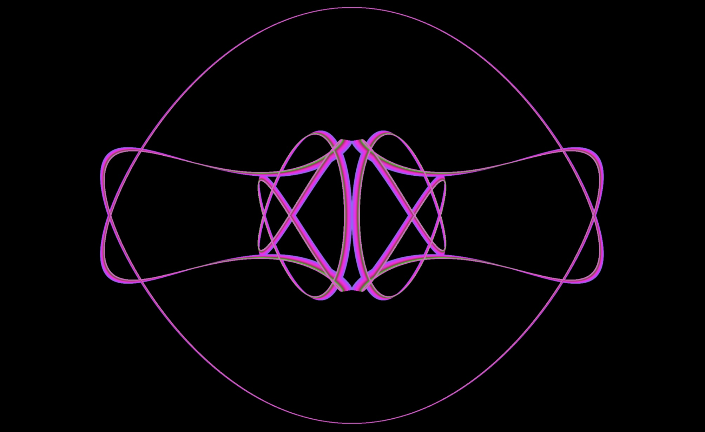

# Lissajous

Animated generative Lissajous figures created in Processing.

This repo contains Processing and p5.js code.




## Running p5.js examples locally

You can either load the local HTML files directly in your browser or run a simple webserver.

```sh
# run a simple node web server to serve the files
npx http-server .
```
